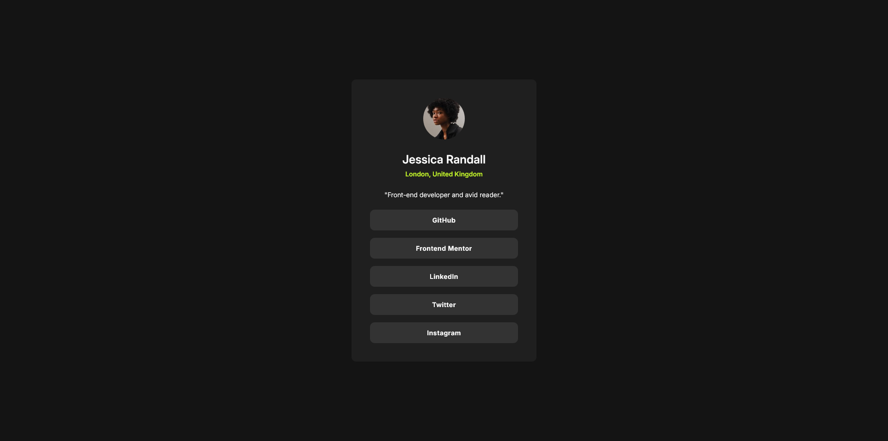

# Frontend Mentor - Social links profile solution

This is a solution to the [Social links profile challenge on Frontend Mentor](https://www.frontendmentor.io/challenges/social-links-profile-UG32l9m6dQ). Frontend Mentor challenges help you improve your coding skills by building realistic projects. 

## Table of contents

- [Overview](#overview)
  - [The challenge](#the-challenge)
  - [Screenshot](#screenshot)
  - [Links](#links)
- [My process](#my-process)
  - [Built with](#built-with)
  - [Useful resources](#useful-resources)
- [Author](#author)

## Overview

### The challenge

Users should be able to:

- See hover and focus states for all interactive elements on the page
- View the page without any problems on screen sizes ranging from 320px and up

### Screenshot

### Links

- Solution URL: [View solution on Frontend Mentor](https://www.frontendmentor.io/solutions/responsive-social-links-profile-using-flexbox-and-clamp-iGMOqroZH2)
- Live Site URL: [View live site](https://alexander3717.github.io/SocialLinksProfileChallenge/)

## My process

### Built with

- CSS custom properties
- Flexbox
- Mobile-first workflow

### Useful resources

- [https://utopia.fyi/clamp/calculator](https://utopia.fyi/clamp/calculator) - This helped me make padding of the card responsive without using media queries

## Author

- Frontend Mentor - [@Alexander3717](https://www.frontendmentor.io/profile/Alexander3717)
